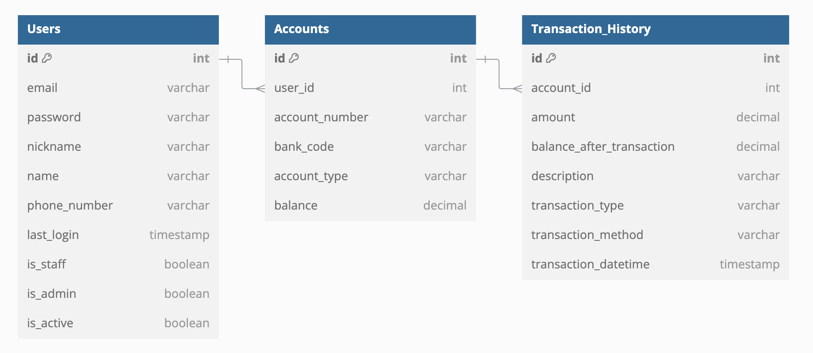

# Django_mini4

# 데이터베이스 테이블 설명

이 문서는 사용자 관리 및 거래 기록을 위한 데이터베이스 테이블 구조를 설명합니다. 주요 테이블은 `Users`, `Accounts`, 그리고 `Transaction_History`입니다.

## 1. Users 테이블

| 필드명         | 데이터 타입   | 설명                              |
|----------------|----------------|-----------------------------------|
| id             | int            | 기본 키, 자동 증가               |
| email          | varchar        | 고유 이메일 주소                  |
| password       | varchar        | 사용자 비밀번호                   |
| nickname       | varchar        | 사용자 닉네임                    |
| name           | varchar        | 사용자 이름                      |
| phone_number   | varchar        | 전화번호                          |
| last_login     | timestamp      | 마지막 로그인 시간                |
| is_staff       | boolean        | 관리자 권한 여부                  |
| is_admin       | boolean        | 관리자 여부                       |
| is_active      | boolean        | 계정 활성화 여부                 |

### 설명
`Users` 테이블은 시스템의 사용자 정보를 저장합니다. 각 사용자는 고유한 이메일 주소를 가지고 있으며, 비밀번호와 함께 추가적인 정보를 포함합니다. 이 테이블은 사용자의 권한 및 활성화 상태를 관리하는 데 필요한 필드를 포함합니다.

---

## 2. Accounts 테이블

| 필드명         | 데이터 타입   | 설명                              |
|----------------|----------------|-----------------------------------|
| id             | int            | 기본 키, 자동 증가               |
| user_id        | int            | 외래 키, `Users` 테이블의 `id`를 참조 |
| account_number  | varchar        | 고유 계좌 번호                   |
| bank_code      | varchar        | 은행 코드                         |
| account_type   | varchar        | 계좌 유형                         |
| balance        | decimal        | 계좌 잔액                         |

### 설명
`Accounts` 테이블은 사용자의 은행 계좌 정보를 저장합니다. 각 계좌는 특정 사용자(`Users` 테이블)와 연결되어 있으며, 고유한 계좌 번호와 함께 은행 코드, 계좌 유형 및 잔액 정보를 포함합니다.

---

## 3. Transaction_History 테이블

| 필드명                     | 데이터 타입   | 설명                              |
|----------------------------|----------------|-----------------------------------|
| id                         | int            | 기본 키, 자동 증가               |
| account_id                 | int            | 외래 키, `Accounts` 테이블의 `id`를 참조 |
| amount                     | decimal        | 거래 금액                        |
| balance_after_transaction   | decimal        | 거래 후 잔액                     |
| description                | varchar        | 거래 설명                        |
| transaction_type           | varchar        | 거래 유형                        |
| transaction_method         | varchar        | 거래 방법                        |
| transaction_datetime       | timestamp      | 거래 발생 시간                  |

### 설명
`Transaction_History` 테이블은 각 계좌에서 발생한 거래 기록을 저장합니다. 각 거래는 특정 계좌(`Accounts` 테이블)와 연결되어 있으며, 거래 금액, 거래 후 잔액, 설명 및 거래 유형 등의 정보를 포함합니다.

---

## 테이블 간의 관계

- **Users와 Accounts**: 
  - `Users` 테이블의 `id`는 `Accounts` 테이블의 `user_id` 외래 키로 참조됩니다. 이는 각 계좌가 특정 사용자에게 속함을 나타냅니다.
  
- **Accounts와 Transaction_History**: 
  - `Accounts` 테이블의 `id`는 `Transaction_History` 테이블의 `account_id` 외래 키로 참조됩니다. 이는 각 거래가 특정 계좌에 연결되어 있음을 나타냅니다.

이러한 구조는 사용자 관리와 금융 거래 기록을 효율적으로 관리할 수 있도록 설계되었습니다.